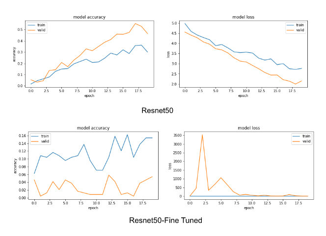
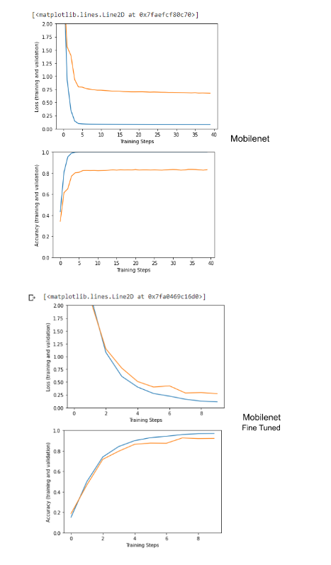
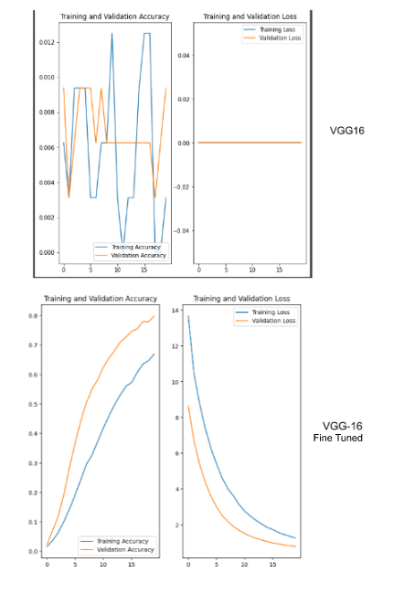

# 301Project

|       |  Not tuned | Fine-tuned
| ----------- | ----------- |-----------
| Mobilenets      | High accuracy (overfitting?)       |Accuracy drop a bit  
|  Resnet50   | Slow; Low accuracy      |Fast; Lower accuracy
|VGG16|Slow; Low accuracy      |Fast; Higher accuracy

Deep learning techniques, like CNNs, have superior accuracy compared with classical machine learning methods. Using classical methods that rely on hand-crafted features might not be generalizable to other flower images or similar flower images with different conditions such as flower pose or variation of surrounding objects. In addition, the advance of hardware capabilities, particularly with the use of graphics processing units (GPUs), speed up the processing time of deep learning techniques significantly. 

We also test fine-tuning in models, which is a process used to improve the performance of a pre-trained model on a new task by adjusting the model parameters and retraining the model using a new dataset. 

**Fine-tuning benefits**: 
**Improved performance**: Fine-tuning can often lead to improved performance on the new task, compared to training a model from scratch on a small dataset. This is because the pre-trained model already has learned to extract useful features from images, and fine-tuning allows the model to adapt these features to the new task.

**Reduced training time**: Fine-tuning a pre-trained model is typically faster than training a model from scratch, as the model does not need to learn all the features from scratch. This can be particularly useful when the new dataset is small and the training process would be slow with a randomly initialized model.

**Transfer learning**: Fine-tuning allows for the transfer of knowledge learned from one task to another related task. This can be particularly useful when the new task is similar to a task for which a large dataset is available, as the pre-trained model can use its knowledge of general image features to perform well on the new task.

The highest accuracy and fastest training time we got is in untuned Mobilenets model. MobileNets are small, low-latency, low-power models parameterized to meet the resource constraints of a variety of use cases. They can be built upon for classification, detection, embedding and segmentation similar to how other popular large scale models. The accuracy dropped a bit after fine-tuning the model. It's possible that the previous model is overfitting to the training data, which means it is learning patterns specific to the training data that do not generalize to the test data. This can happen if the model is too complex for the amount of data it is trained on, or if the model is trained for too many epochs (We trained for 40 epochs in Mobilenets model). Fine-tuning may help us solve this problem, and as a consequence, the accuracy dropped, but still relatively high compared to other models. VGG16 performed better after fine-tuning, but it still takes too much time. MobileNet is designed to be lightweight and efficient, so it may be better suited for datasets that are small or have limited computational resources, just like our dataset. ResNet, as a deeper model, is generally too complex to handle this task because the number of parameters is an overkill, so its accuracy is much lower than Mobilenet and VGG. Overall, Mobilenets model with fine-tuning produces the best results of flower recognition. 

## Resnet50 Accuracy and Loss before and after Fine_tuned
Before fine tuned:loss: 2.7652 - accuracy: 0.3000 - val_loss: 2.1499 - val_accuracy: 0.4641

After fine tuned: loss: 3.8251 - accuracy: 0.1542 - val_loss: 7.5403 - val_accuracy: 0.0542

## Mobilenet12 Accuracy and Loss before and after Fine tuned
Before fine tuned:loss: 0.0803 - accuracy: 1.0000 - val_loss: 0.6747 - val_accuracy: 0.8340 

After fine tuned:loss: 0.1135 - accuracy: 0.9707 - val_loss: 0.2724 - val_accuracy: 0.9220 

## VGG16 Accuracy and Loss before and after Fine_tuned
Before fine tuned:loss: 0.0000e+00 - accuracy: 0.0031 - val_loss: 0.0000e+00 - val_accuracy: 0.0094

After fine tuned:loss: 1.2649 - accuracy: 0.6687 - val_loss: 0.7987 - val_accuracy: 0.7983

